# Hướng dẫn luồng số hoá kiểm và biên bản

> Tài liệu nhập môn dành cho người lần đầu tiếp xúc hệ thống SoHoaBBK.  
> Phạm vi: phiếu kiểm, các nhánh kiểm chuyên biệt và ba loại biên bản/KPH đang có trong hệ thống.

## Cách đọc tài liệu

Nếu bạn là người mới, hãy đọc theo thứ tự:

1. [Bức tranh tổng thể](#1-bức-tranh-tổng-thể).
2. [Vai trò trong quy trình](#2-ai-làm-gì-trong-hệ-thống).
3. Chọn đúng [loại kiểm](#3-chọn-đúng-luồng-kiểm) đang cần thực hiện.
4. Nếu có lỗi không phù hợp, đọc [luồng biên bản](#10-từ-phiếu-kiểm-sang-biên-bản).
5. Khi bị dừng ở một trạng thái, tra [Tôi cần làm gì tiếp?](#14-tôi-đang-ở-trạng-thái-này-thì-làm-gì-tiếp).

Các sơ đồ dùng tên nghiệp vụ dễ đọc. Mã trạng thái, quyền và tên dữ liệu kỹ thuật chỉ nằm ở [phụ lục](#phụ-lục-kỹ-thuật).

---

## 1. Bức tranh tổng thể

Một quy trình số hoá kiểm thường đi qua sáu chặng:

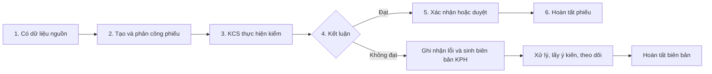

Hiểu ngắn gọn:

- **Dữ liệu nguồn** là lịch đóng cont, chứng từ nhập, kế hoạch sản xuất hoặc kế hoạch nhập BTP.
- **Phiếu kiểm** là nơi KCS ghi nhận kết quả thực tế.
- **Kết luận** cho biết đối tượng kiểm đạt hay không đạt.
- **Biên bản/KPH** là quy trình xử lý tiếp khi có điểm không phù hợp; biên bản không thay thế phiếu kiểm.
- Không phải mọi phiếu không đạt đều tự sinh biên bản. Với các luồng có nút **Sinh biên bản**, người có quyền phải chủ động thao tác.

### Một số nguyên tắc xuyên suốt

- Chỉ chọn được nguồn còn hiệu lực và chưa bị tạo phiếu trùng theo quy tắc của từng loại kiểm.
- Sau khi phiếu chuyển sang chờ duyệt/xác nhận hoặc hoàn tất, dữ liệu kiểm thường bị khóa.
- Số lượng lỗi không được âm và không được vượt số lượng kiểm/số lượng hiệu lực.
- Một số bước chỉ xuất hiện khi tài khoản có đúng quyền và thuộc đúng bộ phận.
- Nếu màn hình không có nút mong đợi, hãy kiểm tra **trạng thái**, **quyền**, **bộ phận** và **dữ liệu bắt buộc** trước.

---

## 2. Ai làm gì trong hệ thống?

| Vai trò dễ hiểu | Trách nhiệm chính |
|---|---|
| **Tổ trưởng/leader KCS** | Chọn loại kiểm, chọn dữ liệu nguồn, tạo phiếu và phân công KCS. Có thể thiết lập checklist ở luồng phiếu thường. |
| **KCS thực hiện** | Nhập kết quả kiểm, lỗi, số lượng, ảnh; chốt kết luận và chuyển phiếu sang bước xác nhận/duyệt. |
| **Trưởng bộ phận/PX** | Xác nhận hoặc duyệt phiếu sau khi KCS hoàn tất. Với luồng trên chuyền/cuối chuyền/công đoạn, người duyệt phải thuộc bộ phận duyệt của phiếu. |
| **Kho** | Xác nhận số lượng thực nhập theo từng dòng LOT trong luồng SXBT. |
| **TP B8/người quản lý chất lượng** | Quản lý nội dung KPH, đề xuất xử lý, xác nhận mức độ biên bản SXBT hoặc hoàn tất bước được phân quyền. |
| **Bộ phận được lấy ý kiến** | Nhân viên nhập ý kiến chung; TBP xác nhận hoặc trả lại KPH V01. |
| **Người theo dõi KPH** | Đánh giá hiệu lực sau xử lý và đóng biên bản; nếu không thỏa mãn phải ghi số phiếu KPH mới. |

> Một người có thể mang nhiều vai trò nếu tài khoản có nhiều quyền. Hệ thống vẫn kiểm tra thêm bộ phận và trạng thái hiện tại của phiếu.

---

## 3. Chọn đúng luồng kiểm

| Nhu cầu kiểm | Dữ liệu bắt đầu | Luồng cần đọc |
|---|---|---|
| Kiểm vật tư đầu vào | Chứng từ nhập chưa kiểm | [Phiếu checklist/AQL](#4-luồng-phiếu-checklistaql-dùng-chung) |
| Kiểm đóng cont | Lịch đóng cont ESAM chưa kiểm | [Phiếu checklist/AQL](#4-luồng-phiếu-checklistaql-dùng-chung) |
| Loại kiểm chuẩn khác có nhóm kiểm/checklist | Sản phẩm và nguồn tương ứng | [Phiếu checklist/AQL](#4-luồng-phiếu-checklistaql-dùng-chung) |
| Theo dõi chất lượng trong ngày sản xuất | Kế hoạch sản xuất có lịch trong ngày | [Kiểm trên chuyền](#5-luồng-kiểm-trên-chuyền) |
| Kiểm tổng hợp cuối chuyền | Một hoặc nhiều kế hoạch sản xuất | [Kiểm cuối chuyền](#6-luồng-kiểm-cuối-chuyền) |
| Kiểm theo công đoạn, LOT/LXVT | Kế hoạch sản xuất theo ngày/phân xưởng | [Kiểm công đoạn](#7-luồng-kiểm-công-đoạn) |
| Kiểm bán thành phẩm sản xuất bổ trợ | Kế hoạch nhập BTP chưa kiểm | [Kiểm SXBT](#8-luồng-kiểm-sản-xuất-bổ-trợ-sxbt) |
| Đo thông số kỹ thuật riêng của sản phẩm | Phiếu thường có cấu hình thông số | [Kiểm đặc biệt](#9-nhánh-kiểm-đặc-biệt) |

> Kiểm đặc biệt là **nhánh bổ sung** bên trong phiếu thường, không phải một phiếu độc lập.

---

## 4. Luồng phiếu checklist/AQL dùng chung

Áp dụng cho đầu vào, đóng cont và các loại kiểm chuẩn sử dụng nhóm kiểm, mục kiểm và AQL.

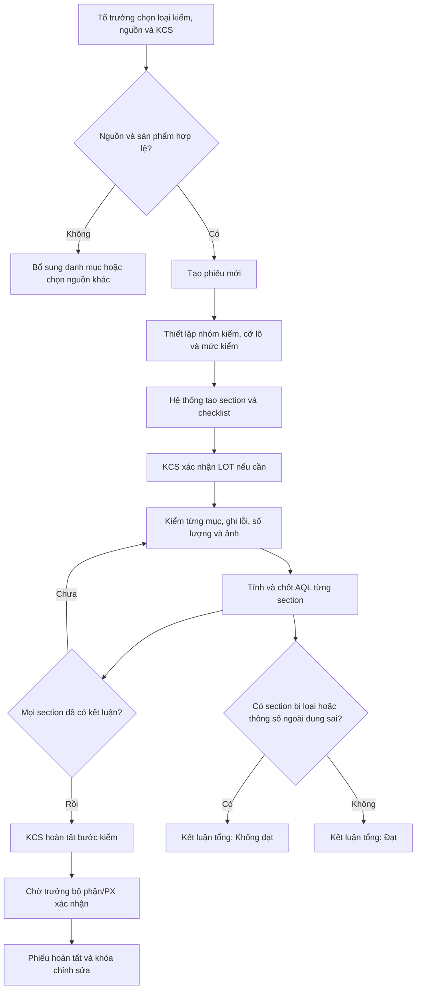

### Điều kiện dữ liệu theo bước

| Bước | Ai làm | Dữ liệu cần có | Điều kiện đi tiếp | Kết quả |
|---|---|---|---|---|
| Tạo phiếu | Tổ trưởng KCS | Loại kiểm, KCS phụ trách, ít nhất một nguồn | Nguồn chưa bị kiểm trùng; sản phẩm đã có trong danh mục và thuộc nhóm kiểm | Phiếu mới được tạo |
| Thiết lập kiểm | Tổ trưởng hoặc KCS được phép | Nhóm kiểm, cỡ lô, mức kiểm | Phiếu còn mới; cỡ lô hợp lệ | Sinh section và checklist |
| Nhập kết quả | KCS/leader | Kết quả từng mục, lỗi, số lượng lỗi, ảnh nếu có | Section chưa chốt; tài khoản có quyền thực hiện kiểm | Phiếu chuyển sang đang kiểm |
| Chốt AQL | KCS/leader | Dữ liệu các mục trong section | Đủ dữ liệu mà quy tắc AQL yêu cầu | Section có kết luận `ACCEPT` hoặc `REJECT` |
| Hoàn tất bước kiểm | KCS | Tất cả section đã kết luận | Cỡ mẫu lớn nhất không vượt số lượng hiệu lực | Chờ trưởng bộ phận/PX xác nhận |
| Xác nhận | Trưởng bộ phận/PX | Phiếu đã chờ xác nhận | Có quyền xác nhận PX | Phiếu hoàn tất |

### Khi nào kết luận không đạt?

- Có ít nhất một section có kết luận `REJECT`; hoặc
- Có kết quả kiểm đặc biệt nằm ngoài khoảng dung sai.

### Dữ liệu bị khóa khi nào?

- Mục kiểm đã được chốt kết luận thì không sửa như mục đang mở.
- Khi phiếu đã chuyển sang chờ trưởng bộ phận/PX hoặc hoàn tất, phần kiểm không còn là dữ liệu làm việc.
- Chỉ có thể xóa phiếu mới khi chưa phát sinh section/dữ liệu kiểm/biên bản và người dùng có quyền phù hợp.

### Nếu chưa đi tiếp được

| Hiện tượng | Kiểm tra |
|---|---|
| Không tạo được phiếu | Sản phẩm đã có nhóm kiểm chưa; nguồn có bị tạo phiếu trước đó không. |
| Không thấy checklist | Phiếu còn ở bước tạo mới và đã thiết lập section chưa. |
| Không thể hoàn tất | Còn section chưa chốt AQL hoặc cỡ mẫu vượt số lượng hiệu lực. |
| Kết luận bị không đạt dù section đạt | Kiểm tra kết quả đo đặc biệt có nằm ngoài dung sai không. |

---

## 5. Luồng kiểm trên chuyền

Kiểm trên chuyền ghi nhận chất lượng theo **ngày → khung giờ → công đoạn → lỗi**. Chỉ khung giờ có dữ liệu được lưu vào hệ thống.

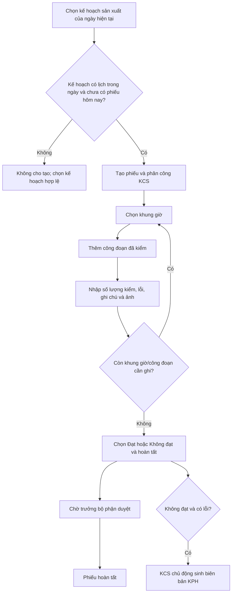

### Điều kiện dữ liệu theo bước

| Bước | Ai làm | Dữ liệu cần có | Điều kiện đi tiếp | Kết quả |
|---|---|---|---|---|
| Tạo phiếu | Tổ trưởng KCS | Kế hoạch, ngày kiểm, KCS | Ngày kiểm là ngày hiện tại; kế hoạch có lịch trong ngày; chưa có phiếu cùng kế hoạch trong ngày | Phiếu mới |
| Ghi nhận | KCS | Khung giờ, công đoạn, số lượng, lỗi/ảnh nếu có | Phiếu chưa chờ duyệt hoặc hoàn tất | Tạo slot và entry thực tế |
| Hoàn tất | KCS | Kết luận `Đạt` hoặc `Không đạt` | Tổng số lượng lỗi không vượt số lượng hiệu lực; xác định được bộ phận duyệt | Chờ TBP duyệt |
| Duyệt | Trưởng bộ phận | Phiếu đang chờ duyệt | Có quyền duyệt và đúng bộ phận; dữ liệu duyệt hợp lệ | Hoàn tất |
| Sinh biên bản | KCS | Phiếu không đạt và có lỗi | Phiếu ở giai đoạn cho phép; chưa có biên bản | Liên kết sang biên bản KPH |

### Quy tắc chỉnh sửa

- KCS thường chỉ xóa được công đoạn do chính mình ghi nhận.
- Người có quyền quản lý cao hơn có thể quản lý toàn bộ entry.
- Không thể xóa entry khi phiếu đã chờ duyệt/xác nhận hoặc hoàn tất.
- Biên bản không tự sinh khi chọn **Không đạt**; phải bấm **Sinh biên bản**.

---

## 6. Luồng kiểm cuối chuyền

Một phiếu cuối chuyền có thể gom nhiều kế hoạch sản xuất. Mỗi kế hoạch có số lượng thực tế và danh sách lỗi riêng.

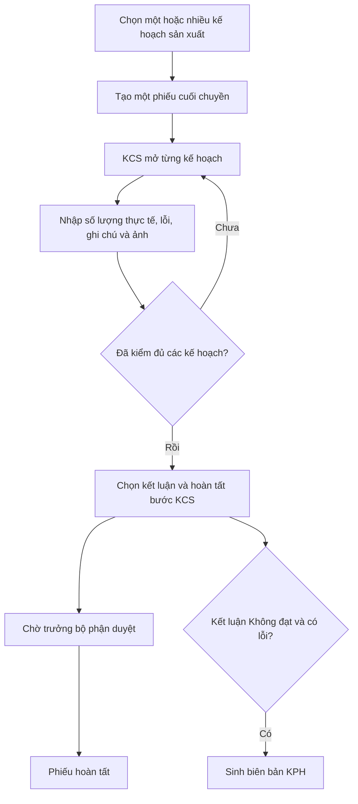

### Điều kiện dữ liệu theo bước

| Bước | Ai làm | Dữ liệu cần có | Điều kiện đi tiếp | Kết quả |
|---|---|---|---|---|
| Tạo phiếu | Tổ trưởng KCS | Ít nhất một kế hoạch, KCS phụ trách | Kế hoạch còn trong danh sách chưa kiểm | Một phiếu chứa các dòng kế hoạch |
| Kiểm từng kế hoạch | KCS | Số lượng thực tế, lỗi, số lượng lỗi, ghi chú/ảnh | Phiếu chưa khóa | Dữ liệu được lưu theo kế hoạch |
| Hoàn tất | KCS | Kết luận `Đạt` hoặc `Không đạt` | Tổng lỗi của mỗi kế hoạch không vượt số lượng hiệu lực; có bộ phận duyệt | Chờ TBP duyệt |
| Duyệt | Trưởng bộ phận | Phiếu đang chờ duyệt | Đúng quyền/bộ phận; người hoàn tất không được tự duyệt chính phiếu đó | Hoàn tất |
| Sinh biên bản | KCS | Phiếu không đạt và có lỗi | Chưa có biên bản | Mở luồng KPH |

### Điểm dễ nhầm

- Đây là luồng riêng của `LoaiKiemId = 3`, không còn dùng màn checklist/AQL chung.
- Số lượng hiệu lực ưu tiên số lượng thực tế; nếu chưa có thì dùng số lượng kế hoạch.
- Người vừa hoàn tất phiếu không được tự duyệt phiếu cuối chuyền.

---

## 7. Luồng kiểm công đoạn

Phiếu công đoạn tổ chức dữ liệu theo **phiếu → kế hoạch → LOT/LXVT → lỗi**. Một phiếu phải có ít nhất một kế hoạch trước khi hoàn tất.

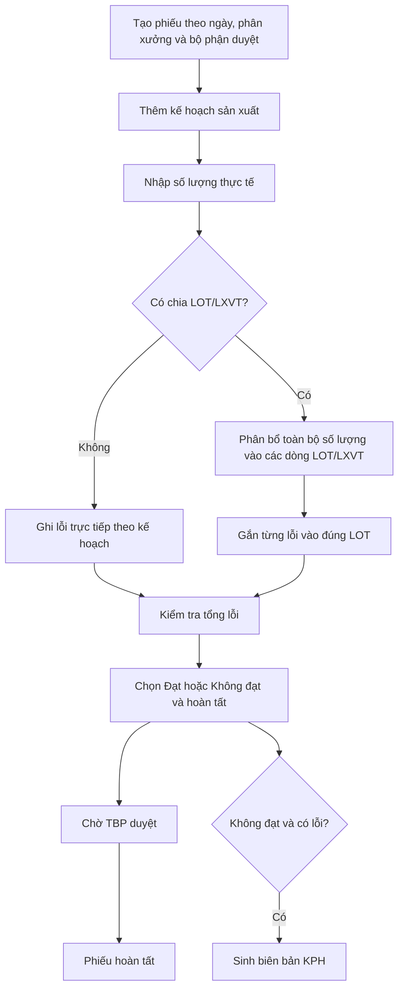

### Điều kiện dữ liệu theo bước

| Bước | Ai làm | Dữ liệu cần có | Điều kiện đi tiếp | Kết quả |
|---|---|---|---|---|
| Tạo phiếu | KCS/người có quyền | Ngày kiểm, phân xưởng/bộ phận duyệt; tổ máy nếu có | Xác định được bộ phận duyệt | Phiếu mới |
| Thêm kế hoạch | KCS | Kế hoạch sản xuất | Phiếu còn mở; kế hoạch chưa tồn tại trong cùng phiếu | Có dòng kế hoạch |
| Phân bổ LOT/LXVT | KCS | LOT hoặc lệnh xuất vật tư và số lượng từng dòng | Mỗi dòng có LOT hoặc LXVT; số lượng dòng lớn hơn 0 | Dữ liệu phân bổ theo lô |
| Ghi lỗi | KCS | Loại lỗi, số lượng, kết quả sau sửa, ảnh/ghi chú | Số lượng hợp lệ; một lỗi không nhập trùng trong cùng phạm vi; nếu đã chia lô thì lỗi phải gắn đúng LOT | Cập nhật tổng và tỷ lệ lỗi |
| Hoàn tất | KCS | Ít nhất một kế hoạch và kết luận | Tổng phân bổ LOT bằng số lượng hiệu lực; không còn lỗi chưa gắn LOT; lỗi mỗi LOT và toàn kế hoạch không vượt số lượng tương ứng | Chờ TBP duyệt |
| Duyệt | Trưởng bộ phận | Phiếu đang chờ duyệt | Đúng bộ phận/quyền duyệt | Hoàn tất |
| Sinh biên bản | KCS | Phiếu không đạt, có ít nhất một lỗi | Trạng thái chờ duyệt hoặc hoàn tất; chưa có biên bản | Tạo biên bản KPH |

### Công thức kiểm tra quan trọng

- `Tổng phân bổ các LOT = Số lượng hiệu lực của kế hoạch`.
- `Tổng lỗi của một LOT ≤ Số lượng của LOT đó`.
- `Tổng lỗi của kế hoạch ≤ Số lượng hiệu lực của kế hoạch`.
- Khi đã tạo dòng LOT, lỗi danh mục, lỗi bụi bẩn và lỗi côn trùng phải được gắn vào LOT.

---

## 8. Luồng kiểm sản xuất bổ trợ (SXBT)

SXBT là luồng riêng cho bán thành phẩm. Sau bước KCS, Kho xác nhận số lượng thực nhập trước khi phiếu kết thúc.

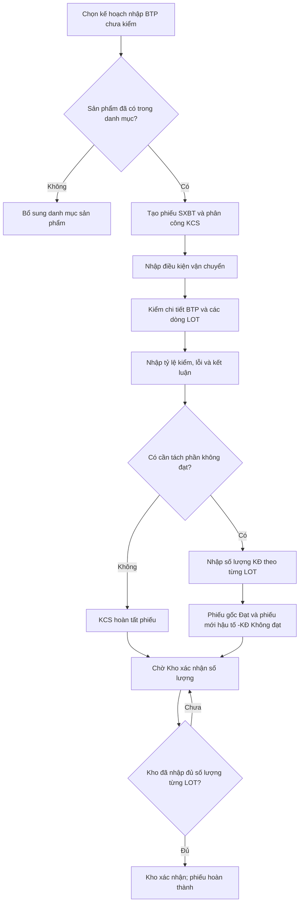

### Điều kiện dữ liệu theo bước

| Bước | Ai làm | Dữ liệu cần có | Điều kiện đi tiếp | Kết quả |
|---|---|---|---|---|
| Tạo phiếu | Tổ trưởng KCS | Loại SXBT, KCS, kế hoạch nhập BTP | Kế hoạch hợp lệ, số lượng lớn hơn 0, chưa có phiếu; sản phẩm đã có trong danh mục | Phiếu SXBT mới |
| Lưu kiểm | KCS | Điều kiện vận chuyển, BTP/LOT, tỷ lệ kiểm, lỗi, kết luận | Phiếu chưa khóa | Lưu nháp dữ liệu mới nhất |
| Hoàn tất thường | KCS | Kết luận `Đạt` hoặc `Không đạt` | Đã lưu dữ liệu mới nhất | Chờ Kho xác nhận |
| Tách không đạt | KCS | Số lượng KĐ nguyên theo từng `lotRowId` | Có ít nhất một dòng KĐ; phiếu chỉ tách một lần; phần KĐ nhận ít nhất một lỗi | Phiếu gốc đạt và phiếu `-KĐ` không đạt |
| Xác nhận Kho | Kho | Số lượng Kho xác nhận trên mọi dòng LOT | Đã nhập đủ số lượng cho cả nhóm phiếu liên quan | Phiếu hoàn thành |

### Dữ liệu đi đâu khi tách?

- Dòng LOT có số lượng KĐ lớn hơn `0` được phân tách sang phiếu `-KĐ`.
- Lỗi gắn với dòng LOT có số lượng KĐ lớn hơn `0` chuyển sang phiếu `-KĐ`.
- Lỗi ở dòng có số lượng KĐ bằng `0` hoặc lỗi chưa gắn LOT giữ ở phiếu gốc.
- Cả phiếu gốc và phiếu `-KĐ` đều chờ Kho xác nhận.

### Khi nào bị khóa?

Phần dữ liệu KCS bị khóa khi phiếu đã chuyển sang chờ Kho, các trạng thái xác nhận cũ, hoàn thành hoặc hoàn tất. Bước xác nhận SXBT điện tử cũ vẫn tồn tại ở backend nhưng hiện không hiển thị trong Web/Mobile; bộ phận SXBT ký trên bản cứng.

---

## 9. Nhánh kiểm đặc biệt

Nhánh này xuất hiện khi sản phẩm của phiếu thường đã được cấu hình thông số kỹ thuật và dung sai.

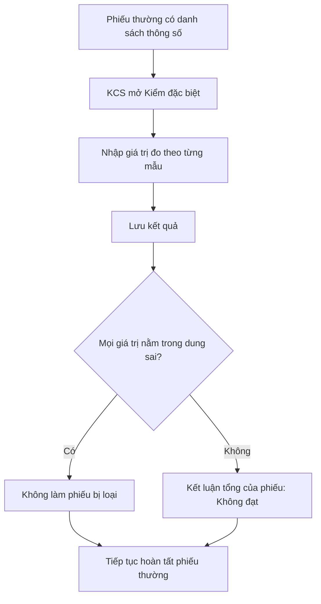

### Điều kiện dữ liệu

| Nội dung | Quy tắc |
|---|---|
| Hiển thị chức năng | API chi tiết trả về danh sách thông số của sản phẩm. |
| Giá trị hợp lệ | Giá trị đo phải là số khi được dùng để so sánh. |
| Khoảng đạt | `Giá trị chuẩn - dung sai âm ≤ giá trị đo ≤ giá trị chuẩn + dung sai dương`. |
| Ảnh hưởng kết luận | Chỉ cần một mẫu nằm ngoài khoảng là phiếu có yếu tố không đạt. |

---

## 10. Từ phiếu kiểm sang biên bản

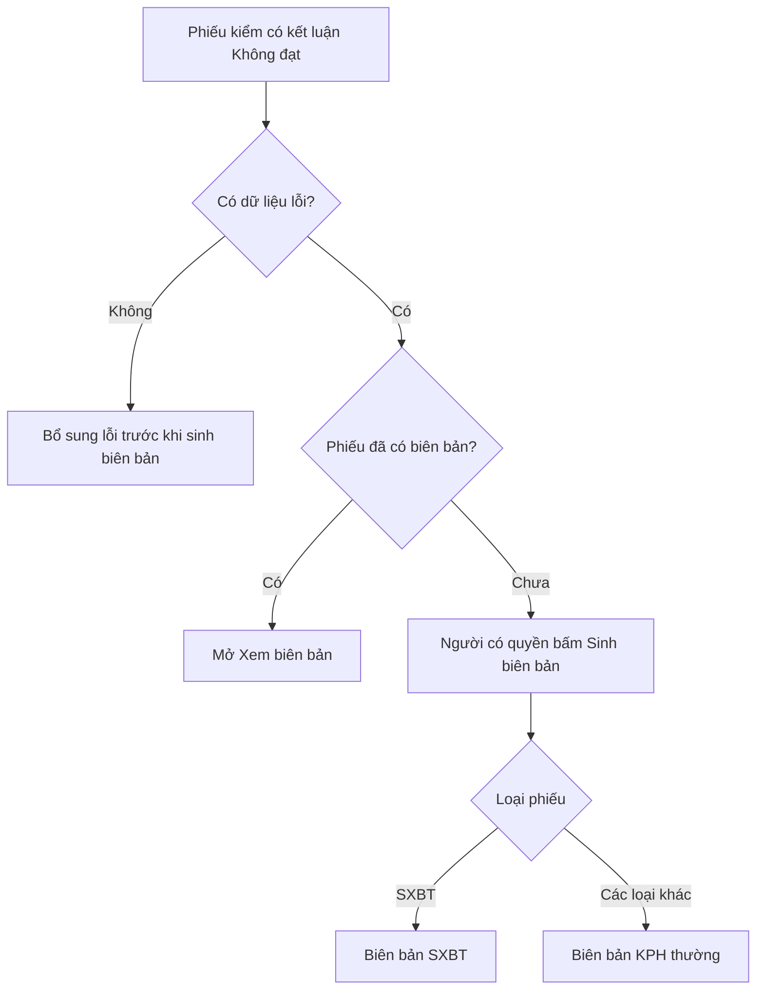

### Điều kiện chung để sinh biên bản từ phiếu kiểm

- Phiếu đã được kết luận **Không đạt**.
- Phiếu có ít nhất một dữ liệu lỗi thực tế.
- Phiếu đang ở trạng thái cho phép sinh biên bản, thường là chờ duyệt hoặc đã hoàn tất.
- Phiếu chưa có biên bản; nếu đã có, hệ thống trả về/mở biên bản hiện hữu thay vì tạo trùng.
- Người thao tác có quyền thực hiện kiểm theo luồng hiện tại.

> Với phiếu checklist/AQL cũ, việc liên kết biên bản có thể được thực hiện trong stored procedure nghiệp vụ. Với kiểm trên chuyền, cuối chuyền và công đoạn hiện hành, UI có thao tác **Sinh biên bản** rõ ràng.

---

## 11. Luồng biên bản KPH V01

Đây là luồng xử lý KPH chính cho biên bản thường và phiếu KPH độc lập sử dụng mẫu V01.

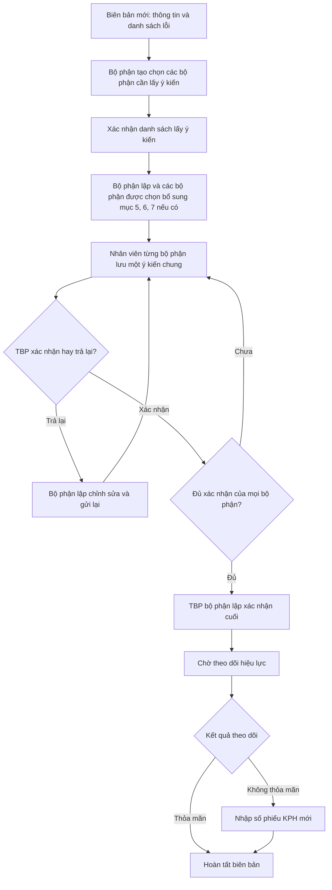

### Điều kiện dữ liệu theo bước

| Bước | Ai làm | Dữ liệu cần có | Điều kiện đi tiếp | Kết quả |
|---|---|---|---|---|
| Hoàn thiện thông tin | Bộ phận tạo | Thông tin đầu phiếu, mô tả và ít nhất một lỗi | Biên bản chưa khóa; đúng bộ phận tạo hoặc admin theo quyền | Sẵn sàng phân công/lấy ý kiến |
| Chọn bộ phận | Bộ phận tạo | Ít nhất một bộ phận cần lấy ý kiến | Chưa xác nhận cuối | Danh sách ý kiến được chốt |
| Mục 5/6/7 | Bộ phận lập hoặc nhân viên thuộc bộ phận được xin ý kiến | Có thể để trống hoặc nhập nội dung phát sinh | Trong vòng xin ý kiến: các bộ phận được chọn đều được nhập; khi trả lại: chỉ bộ phận lập được chỉnh sửa; sau xác nhận cuối thì khóa | Không dùng làm điều kiện hoàn tất |
| Lưu ý kiến | Bất kỳ nhân viên đúng bộ phận | Một nội dung không rỗng; dùng “Không có ý kiến” nếu không góp ý | Đang ở vòng xin ý kiến hiện tại và chưa được TBP ký | Chờ TBP xác nhận |
| Xác nhận/trả lại | TBP đúng bộ phận hoặc Admin | Phải có ý kiến; trả lại bắt buộc có lý do | Đúng vòng hiện tại | Ghi chữ ký hoặc mở lại phiếu cho bộ phận lập |
| Gửi lại | Người lập, TBP bộ phận lập hoặc Admin | Thông tin cơ bản, ít nhất một lỗi và ít nhất một bộ phận | Phiếu đang ở `TRA_LAI_CHINH_SUA` | Tăng vòng và yêu cầu mọi bộ phận lưu/ký lại |
| Xác nhận cuối | TBP bộ phận lập hoặc Admin | Mọi bộ phận có ý kiến và chữ ký TBP trong vòng hiện tại | Chưa xác nhận trước đó | Chuyển sang chờ theo dõi |
| Theo dõi | Người có quyền theo dõi/Kết luận | Kết quả và ghi chú; số phiếu KPH mới nếu không thỏa mãn | Biên bản đang chờ theo dõi và chưa được đánh giá | Hoàn tất, khóa đánh giá |

### Quy tắc khóa quan trọng

- Sau khi gửi xin ý kiến, thông tin đầu phiếu, lỗi và danh sách bộ phận bị khóa; mục 5/6/7 vẫn mở cho bộ phận lập và các bộ phận được xin ý kiến.
- Mục 5/6/7 chỉ bị khóa sau xác nhận cuối của TBP bộ phận lập. Việc có hay không có nội dung ở ba mục này không chặn luồng.
- Trả lại làm mất hiệu lực toàn bộ chữ ký của vòng hiện tại nhưng giữ ý kiến cũ làm nháp/lịch sử.
- Sau khi gửi lại, mọi bộ phận phải lưu ý kiến và được TBP xác nhận lại.
- Với biên bản sinh từ phiếu kiểm, sửa danh sách lỗi tạo một bản hiệu chỉnh riêng cho biên bản; dữ liệu và ảnh trên phiếu kiểm nguồn không bị sửa ngược.
- Sau xác nhận cuối của bộ phận tạo, nội dung chuyển sang theo dõi và bị khóa theo luồng.
- Kết quả theo dõi chỉ ghi một lần; `Không thỏa mãn` bắt buộc có số phiếu KPH mới.
- File đính kèm là phần hồ sơ bổ sung và không bị khóa theo trạng thái: mọi tài khoản đã đăng nhập đều có thể thêm, xem và tải file trên Web.
- Chỉ người đã tải file lên hoặc Admin mới được xóa file đó.
- Trên bản in V01, cột ý kiến ghi nội dung/ngày lưu của nhân viên; cột xác nhận chỉ ghi TBP đã ký trong vòng hiện tại. Chữ ký cuối lấy từ TBP bộ phận lập.

---

## 12. Luồng biên bản SXBT

Biên bản SXBT có chuỗi xác nhận phụ thuộc mức độ không phù hợp.

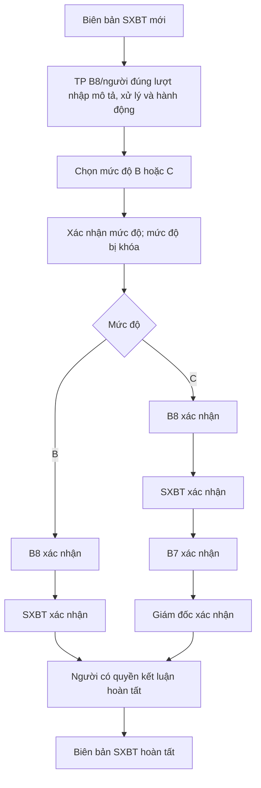

### Điều kiện dữ liệu theo bước

| Bước | Ai làm | Dữ liệu cần có | Điều kiện đi tiếp | Kết quả |
|---|---|---|---|---|
| Lưu nháp | TP B8 hoặc bộ phận đúng lượt | Mô tả, mức độ dự kiến, dòng xử lý, hành động | Trước khi bắt đầu luồng hoặc đúng bộ phận đang chờ | Cập nhật bản nháp |
| Xác nhận mức độ | Người có quyền phù hợp | Chỉ `B` hoặc `C` | Mức độ chưa được xác nhận | Khóa mức độ và tạo chuỗi bước |
| Xác nhận từng bước | Bộ phận đang đến lượt | Nội dung đã được kiểm tra/cập nhật | Bộ phận tài khoản trùng bộ phận của bước đầu tiên chưa xác nhận | Chuyển sang bộ phận kế tiếp |
| Hoàn tất | Người có quyền kết luận | Các bước xác nhận đã hoàn thành theo stored procedure | Biên bản sẵn sàng kết thúc | Trạng thái hoàn tất |

### Chuỗi bộ phận

- **Mức B:** B8 → SXBT.
- **Mức C:** B8 → SXBT → B7 → Giám đốc.
- Sau khi xác nhận mức độ, không thể đổi từ B sang C hoặc ngược lại.
- File đính kèm không phụ thuộc lượt xác nhận: mọi tài khoản đã đăng nhập đều có thể thêm, xem và tải file trên Web; chỉ chủ file hoặc Admin được xóa.

---

## 13. Phiếu xử lý KPH độc lập

Luồng này dùng khi cần lập KPH mà không bắt đầu từ một phiếu kiểm.

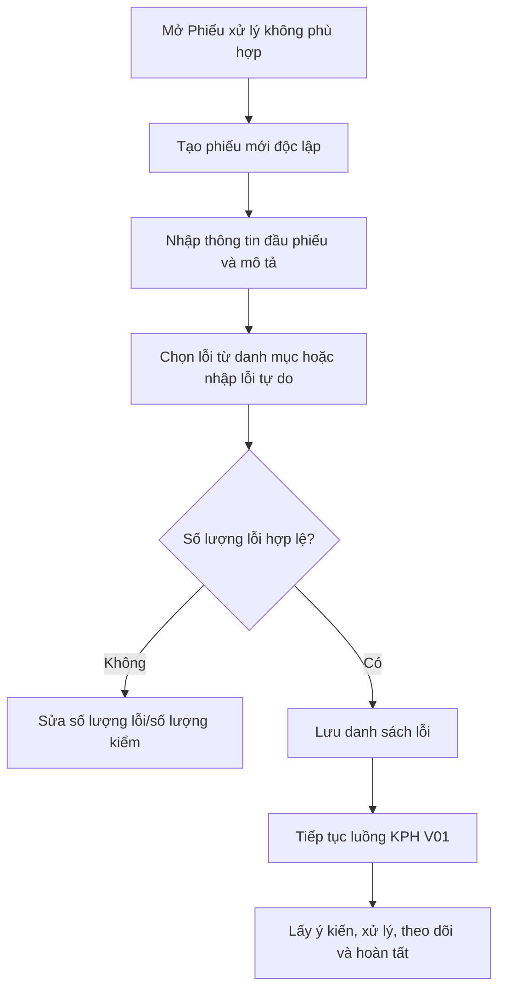

### Điểm khác với biên bản từ phiếu kiểm

| Nội dung | KPH độc lập | Biên bản từ phiếu kiểm |
|---|---|---|
| Cần phiếu kiểm nguồn | Không | Có |
| Cần kế hoạch sản xuất | Không | Tùy loại kiểm |
| Danh sách lỗi | Chọn danh mục hoặc nhập tự do | Lấy từ dữ liệu lỗi của phiếu kiểm |
| Ảnh lỗi nguồn | Không bắt buộc có từ phiếu | Có thể kế thừa ảnh đã ghi khi kiểm |
| Luồng sau phần lỗi | Dùng hạ tầng KPH V01 | Dùng hạ tầng KPH V01 |

### Điều kiện dữ liệu

- `PhieuKiemId` được phép để trống.
- Số lượng lỗi phải không âm.
- Nếu có số lượng kiểm, số lượng lỗi không được vượt số lượng kiểm.
- Chỉ người có quyền với phần đầu phiếu mới sửa thông tin KPH V01.
- Quyền sửa phần đầu phiếu không ảnh hưởng file đính kèm: mọi tài khoản đã đăng nhập đều có thể thêm, xem và tải file; chỉ người tải lên hoặc Admin được xóa.

### File đính kèm dùng chung cho biên bản

- Hỗ trợ ảnh, PDF, Word, Excel và PowerPoint; tối đa **20 MB mỗi file** và **10 file mỗi lần tải lên**.
- File được tải xuống qua API có xác thực, không có đường dẫn public trực tiếp.
- Có thể tiếp tục đính kèm khi biên bản đã hoàn tất.
- Phiên bản hiện tại chỉ có giao diện đính kèm trên **Web**; ứng dụng Mobile chưa có chức năng chọn file.
- File đính kèm không được đưa vào bản in/PDF của biên bản.

---

## 14. Tôi đang ở trạng thái này thì làm gì tiếp?

| Nhìn thấy trên màn hình | Ý nghĩa | Việc cần làm |
|---|---|---|
| **Tạo mới** | Phiếu chưa có cấu trúc/dữ liệu kiểm | Phiếu thường: thiết lập section. Luồng riêng: bắt đầu nhập kế hoạch/khung giờ/dữ liệu kiểm. |
| **Chưa kiểm / Đã tạo section** | Checklist đã sẵn sàng | Mở từng mục kiểm và nhập kết quả. |
| **Đang kiểm** | Đã có dữ liệu nhưng chưa chốt | Hoàn thiện các mục còn thiếu, kiểm số lượng và chốt kết luận. |
| **Chờ TBP duyệt** | KCS đã hoàn tất | Trưởng bộ phận đúng đơn vị mở phiếu và duyệt. |
| **Chờ xưởng xác nhận** | Phiếu thường đã qua bước KCS | Người có quyền xác nhận PX thực hiện xác nhận. |
| **Chờ Kho xác nhận** | SXBT đã hoàn tất bước KCS | Kho nhập đủ số lượng từng LOT rồi xác nhận. |
| **Hoàn thành / Hoàn tất** | Phiếu đã kết thúc và bị khóa | Xem/in; nếu không đạt và chưa có biên bản thì kiểm tra nút sinh biên bản. |
| **Biên bản mới** | Chưa đủ thông tin và lỗi | Hoàn thiện phần đầu và ít nhất một dòng lỗi. |
| **Chờ xác nhận / lấy ý kiến** | Đang đợi bộ phận liên quan | Nhân viên nhập ý kiến; TBP xác nhận hoặc trả lại. |
| **Trả lại chỉnh sửa** | Một TBP đã trả lại kèm lý do | Bộ phận lập chỉnh sửa và gửi lại để mở vòng xác nhận mới. |
| **Chờ theo dõi** | KPH đã xử lý xong phần nội dung | Người theo dõi đánh giá hiệu lực. |
| **Biên bản hoàn tất** | Đã có đánh giá cuối | Chỉ xem/in; không sửa lại đánh giá. |

---

## 14.1. Luồng bổ sung danh mục lỗi

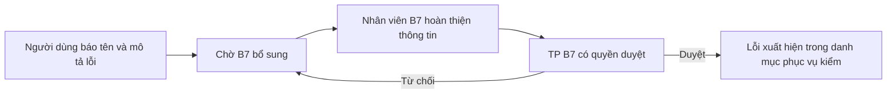

- Mọi tài khoản đăng nhập xem được danh mục lỗi đã duyệt và được báo lỗi mới.
- Người báo bắt buộc nhập tên và mô tả; nhóm lỗi, phân loại và các thông tin khác có thể để trống nếu chưa biết.
- Nhân viên B7 chọn nhóm nghiệp vụ `L01` đến `L05`, bổ sung thông tin và gửi TP B7 duyệt. Mã lỗi được tự sinh khi duyệt nếu chưa có.
- Người thuộc B7 cần role `TP_BP` và permission `DUYET_DANH_MUC_LOI` để duyệt/từ chối; role `ADMIN` được thực hiện toàn bộ thao tác quản trị luồng này.
- Đề xuất chưa duyệt không xuất hiện trong các màn ghi nhận lỗi của phiếu kiểm.

---

## 15. Các lỗi thường gặp và cách tự kiểm tra

| Thông báo/hiện tượng | Nguyên nhân thường gặp | Cách xử lý |
|---|---|---|
| Không thấy nguồn để chọn | Nguồn không còn hiệu lực, không thuộc ngày lọc hoặc đã có phiếu | Kiểm tra ngày/tuần, trạng thái nguồn và danh sách phiếu đã tạo. |
| Sản phẩm chưa tồn tại/chưa thuộc nhóm kiểm | Mã nguồn chưa map sang danh mục kiểm | Bổ sung sản phẩm và nhóm kiểm trong Danh mục. |
| Kế hoạch đã được tạo phiếu | Vi phạm quy tắc chống trùng của loại kiểm | Mở phiếu hiện hữu; không tạo lại. |
| Chỉ được tạo kiểm trên chuyền cho ngày hiện tại | Chọn lịch khác ngày máy chủ hoặc kế hoạch không có lịch trong ngày | Chọn kế hoạch của ngày hiện tại. |
| Tổng lỗi vượt số lượng hiệu lực | Tổng số lượng lỗi lớn hơn số lượng thực tế/kế hoạch | Sửa số lượng thực tế hoặc các dòng lỗi. |
| Tổng phân bổ LOT không khớp | Tổng số lượng các LOT khác số lượng hiệu lực | Điều chỉnh các dòng LOT để tổng khớp tuyệt đối. |
| Còn lỗi chưa gắn LOT | Đã chia LOT nhưng lỗi còn nằm ở cấp kế hoạch | Chọn LOT cho từng lỗi, gồm lỗi bụi bẩn/côn trùng. |
| Không thể hoàn tất phiếu thường | Còn section chưa có kết luận hoặc cỡ mẫu quá lớn | Chốt AQL mọi section và cấu hình lại cỡ mẫu. |
| Không thấy nút duyệt | Sai quyền, sai bộ phận hoặc phiếu chưa ở trạng thái chờ duyệt | Kiểm tra tài khoản và trạng thái phiếu. |
| Không sinh được biên bản | Phiếu chưa kết luận không đạt, chưa có lỗi hoặc đã có biên bản | Bổ sung/chốt dữ liệu; nếu đã có thì chọn Xem biên bản. |
| KPH chưa thể xác nhận cuối | Còn bộ phận chưa có chữ ký TBP trong vòng hiện tại | Kiểm tra tiến độ xác nhận từng bộ phận. Mục 5/6/7 không chặn bước này. |
| Không thể lưu ý kiến | Không đúng bộ phận, nội dung rỗng, phiếu đang chỉnh sửa hoặc đã ký | Nhập nội dung hợp lệ và kiểm tra trạng thái vòng hiện tại. |
| Không thể xác nhận/trả lại | Chưa lưu ý kiến hoặc tài khoản không phải TBP đúng bộ phận | Lưu ý kiến trước, sau đó đăng nhập tài khoản TBP để thao tác. |
| Không thể đổi mức độ biên bản SXBT | Mức B/C đã được xác nhận | Tiếp tục chuỗi xác nhận; mức độ đã khóa. |
| KPH không thỏa mãn nhưng không lưu được | Chưa nhập số phiếu KPH mới | Nhập số phiếu mới trước khi lưu đánh giá. |

---

# Phụ lục kỹ thuật

## A. Mã loại kiểm và cách định tuyến hiện hành

| Nhận diện | Ý nghĩa | Màn/luồng hiện hành |
|---|---|---|
| `MaLoai = DAU_VAO` | Kiểm đầu vào | Phiếu checklist/AQL chung |
| `MaLoai = KIEM_DONG_CONT` | Kiểm đóng cont | Phiếu checklist/AQL chung |
| `LoaiKiemId = 3` / `MaLoai = CUOI_CHUYEN` | Kiểm cuối chuyền | Màn và API cuối chuyền riêng |
| `LoaiKiemId = 4` | SXBT | Màn và API SXBT riêng |
| `LoaiKiemId = 6` / `MaLoai = KIEM_TREN_CHUYEN` | Kiểm trên chuyền | Màn và API trên chuyền riêng |
| Có header công đoạn | Kiểm công đoạn | Module `/phieu-kiem/cong-doan`; dùng chung mã loại kiểm trên chuyền ở dữ liệu gốc nhưng được phân biệt bằng header công đoạn |
| Có danh sách thông số sản phẩm | Kiểm đặc biệt | Nhánh bổ sung trong phiếu thường |

> **Khác tài liệu cũ:** kiểm cuối chuyền hiện dùng `LoaiKiemId = 3` và có route riêng. Mapping cũ nói `LoaiKiemId = 5` là kiểm cuối/đầu ra chỉ nên xem là dữ liệu/hiển thị legacy, không dùng để quyết định luồng hiện hành nếu chưa đối chiếu danh mục thật.

## B. Trạng thái phiếu kiểm

| Mã trạng thái | Ý nghĩa nghiệp vụ | Có thể sửa dữ liệu kiểm? | Bước tiếp theo |
|---|---|---:|---|
| `TAO_MOI` | Phiếu mới | Có | Tạo section hoặc nhập dữ liệu luồng riêng |
| `DA_TAO_SECTION` | Đã có checklist, chưa kiểm/chốt | Có | Kiểm từng mục |
| `DANG_KIEM` | Đang ghi nhận | Có | Hoàn thiện và kết luận |
| `CHO_TBP_DUYET` | Chờ trưởng bộ phận duyệt | Không | Người đúng bộ phận duyệt |
| `CHO_XUONG_XAC_NHAN` | Chờ PX/trưởng bộ phận xác nhận | Không | Xác nhận PX |
| `CHO_KHO_XAC_NHAN` | SXBT chờ Kho | KCS: không; Kho chỉ nhập phần xác nhận | Kho xác nhận đủ LOT |
| `CHO_SXBT_XAC_NHAN` | Trạng thái SXBT dự phòng/legacy | Không | Theo cấu hình cũ; UI hiện ẩn bước này |
| `CHO_KIEM_NGHIEM` | Legacy | Không | Dữ liệu mới nên dùng luồng xác nhận hiện hành |
| `HOAN_THANH` | SXBT đã hoàn thành | Không | Xem/in |
| `HOAN_TAT` | Phiếu đã hoàn tất | Không | Xem/in hoặc mở biên bản |
| `DA_HUY` | Phiếu đã hủy | Không | Không tiếp tục; nguồn có thể được xét lại tùy stored procedure |

## C. Kết luận

| Phạm vi | Giá trị |
|---|---|
| Section/AQL | `ACCEPT`, `REJECT` |
| Phiếu | `DAT`, `KHONG_DAT` |
| Theo dõi KPH | `THOA_MAN`, `KHONG_THOA_MAN` |
| Mức độ biên bản SXBT | `B`, `C` |

## D. Trạng thái biên bản

| Mã trạng thái | Ý nghĩa |
|---|---|
| `BB_MOI` | Biên bản mới |
| `CHO_PHAN_BO_XY_LY` / `CHO_PHAN_BO_XU_LY` | Chờ phân công; hai cách viết đang được hỗ trợ |
| `CHO_XAC_NHAN` | Đang xử lý/lấy ý kiến/xác nhận |
| `TRA_LAI_CHINH_SUA` | Một bộ phận đã trả lại; bộ phận lập được mở sửa và gửi lại |
| `CHO_THEO_DOI` | Đã được bộ phận tạo xác nhận cuối, chờ đánh giá hiệu lực |
| `HOAN_TAT` / `HOAN_THANH` | Luồng biên bản đã kết thúc |
| `BB_SXBT_MOI` | Biên bản SXBT mới |
| `BB_SXBT_TP_B8_DRAFT` | Biên bản SXBT đang ở bản nháp |
| `BB_SXBT_CHO_XAC_NHAN` | Biên bản SXBT đang chạy chuỗi xác nhận |
| `BB_SXBT_HOAN_TAT` | Biên bản SXBT hoàn tất |

Các trạng thái `CHO_TP_B8`, `DA_KET_LUAN`, `DA_XAC_NHAN` vẫn xuất hiện trong UI/dữ liệu cũ. Khi xử lý KPH V01 mới, ưu tiên các mốc lấy ý kiến → xác nhận bộ phận tạo → `CHO_THEO_DOI` → `HOAN_TAT`.

## E. Permission chính

| Permission | Khả năng chính |
|---|---|
| `XEM_PHIEU_KIEM` | Xem phiếu và nguồn được phép |
| `PHAN_BO_KIEM` | Tạo/phân công phiếu, thiết lập section |
| `THUC_HIEN_KIEM` | Nhập và hoàn tất bước KCS; sinh biên bản ở các luồng hỗ trợ |
| `XAC_NHAN_PX` | Xác nhận phiếu thường ở bước PX/trưởng bộ phận |
| `PHAN_CONG_NGUOI_XU_LY` | Duyệt phiếu trên chuyền, cuối chuyền, công đoạn theo bộ phận |
| `XAC_NHAN_KHO_SXBT` | Nhập/xác nhận số lượng Kho cho SXBT |
| `XAC_NHAN_SXBT` | Endpoint xác nhận SXBT dự phòng; hiện ẩn khỏi UI |
| `XAC_NHAN_NGUOI_XU_LY` | Quản lý phân công/xử lý biên bản theo luồng được phép |
| `KET_LUAN` | Kết luận/hoàn tất các bước quản lý và biên bản SXBT |
| `THEO_DOI_KPH` | Ghi đánh giá hiệu lực KPH |
| `DUYET_DANH_MUC_LOI` | Duyệt/từ chối đề xuất danh mục lỗi; người thường phải thuộc B7 và có role `TP_BP`; `ADMIN` được phép thao tác toàn bộ |
| `QUAN_TRI_DM` | Quản trị danh mục; có thể được xem như quyền quản lý ở một số luồng |

> Permission chỉ là điều kiện cần. Nhiều thao tác còn kiểm tra bộ phận, người tạo, người hoàn tất và trạng thái hiện tại.

File đính kèm không yêu cầu permission nghiệp vụ: mọi người dùng đã đăng nhập được thêm/xem/tải; quyền xóa được tính theo người tải lên hoặc vai trò `ADMIN`.

## F. Nguồn dữ liệu và quy tắc chống trùng

| Loại kiểm | Nguồn | Dữ liệu bắt buộc khi tạo | Chống trùng/chặn dữ liệu |
|---|---|---|---|
| Đóng cont | Lịch đóng cont ESAM | Loại kiểm, KCS, GUID lịch, sản phẩm map từ mã hàng, số lượng/ngày giao | Lọc lịch đã kiểm; khóa theo GUID khi tạo |
| Đầu vào | Chứng từ nhập chi tiết | Loại kiểm, KCS, sản phẩm, source ID, số lượng | Chỉ lấy chứng từ chưa kiểm; sản phẩm phải có nhóm kiểm |
| Trên chuyền | Kế hoạch sản xuất trong ngày | Kế hoạch, ngày hiện tại, KCS, sản phẩm | Tối đa một phiếu cho cùng kế hoạch/ngày; kế hoạch phải có lịch ngày |
| Cuối chuyền | Một hoặc nhiều kế hoạch sản xuất | Danh sách kế hoạch, KCS, thông tin snapshot từng kế hoạch | Kế hoạch đã dùng không còn trong danh sách chưa kiểm |
| Công đoạn | Kế hoạch theo ngày/phân xưởng | Ngày kiểm, bộ phận duyệt; sau đó ít nhất một kế hoạch | Không trùng kế hoạch trong cùng phiếu; cập nhật dùng kiểm soát phiên bản dữ liệu |
| SXBT | Kế hoạch nhập BTP | KCS, kế hoạch nhập/source, số lượng | Kế hoạch chưa có phiếu; sản phẩm nguồn phải có trong danh mục |

## G. Dữ liệu khóa theo luồng

| Luồng | Mốc khóa chính |
|---|---|
| Phiếu checklist/AQL | Section/mục đã chốt; phiếu chờ PX hoặc hoàn tất |
| Trên chuyền/cuối chuyền/công đoạn | Khi chuyển `CHO_TBP_DUYET`, sau đó `HOAN_TAT` |
| SXBT | Khi chờ Kho hoặc vào các trạng thái xác nhận/hoàn thành |
| KPH V01 | Sau xác nhận cuối của bộ phận tạo; đánh giá theo dõi chỉ ghi một lần |
| Biên bản SXBT | Mức độ B/C khóa ngay sau xác nhận; nội dung chỉ do bộ phận đúng lượt chỉnh |

## H. Điểm vào trên Web và Mobile

### Web

- Danh sách phiếu: `/phieu-kiem`.
- Tạo phiếu: `/phieu-kiem/create`.
- Phiếu thường: `/phieu-kiem/:id`.
- Trên chuyền: `/phieu-kiem/tren-chuyen/:id`.
- Cuối chuyền: `/phieu-kiem/cuoi-chuyen/:id`.
- Công đoạn: `/phieu-kiem/cong-doan` và `/phieu-kiem/cong-doan/:id`.
- SXBT: `/phieu-kiem/sxbt/:id`.
- Biên bản thường: `/bien-ban/:id`.
- Biên bản SXBT: `/bien-ban/sxbt/:id`.
- KPH độc lập: `/phieu-xu-ly-khong-phu-hop`.

### Mobile

- Danh sách và chi tiết phiếu tự điều hướng sang màn thường, trên chuyền, cuối chuyền, công đoạn hoặc SXBT theo dữ liệu phiếu.
- Kiểm đặc biệt mở từ chi tiết phiếu thường khi có thông số.
- Danh sách biên bản tự phân biệt biên bản thường và SXBT.

## I. Nguồn đối chiếu kỹ thuật

Tài liệu này được tổng hợp theo thứ tự ưu tiên:

1. Route backend hiện hành trong `server/routes/`.
2. Migration mới trong `server/sql/migrations/`.
3. Màn Web/Mobile và API client tương ứng.
4. `AGENT.md` và `README.md` chỉ dùng làm ngữ cảnh; khi khác code hiện hành, code/migration mới được ưu tiên.

Các nhóm file chính để kiểm tra khi luồng thay đổi:

- Phiếu kiểm: `server/routes/phieuKiem.js`, `server/routes/phieuKiemCongDoan.js`.
- Biên bản: `server/routes/bienBan.js`, `server/routes/bienBanSxbt.js`, `server/routes/phieuXuLyKhongPhuHop.js`.
- Web: `sohoa-bbk-web/src/features/PhieuKiem/`, `sohoa-bbk-web/src/features/BienBan/`.
- Mobile: `kcs-mobile/src/screens/`.

---

## Tóm tắt một câu cho người mới

**Chọn đúng nguồn → tạo và phân công phiếu → nhập đủ dữ liệu kiểm → chốt kết luận → người đúng bộ phận xác nhận/duyệt → nếu không đạt thì sinh và xử lý biên bản → theo dõi hiệu lực → hoàn tất.**
